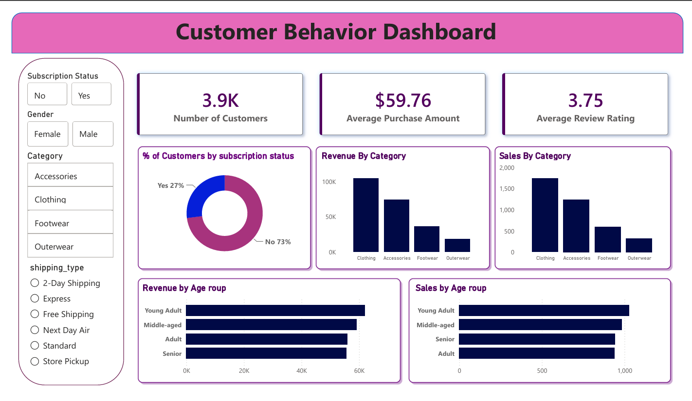

# 🛍️ Customer Behavior Analysis using Python, MySQL & Power BI

## 📌 Project Overview

This project presents an end-to-end **Customer Behavior Analysis** solution using **Python, MySQL, SQL, and Power BI**. The customer shopping dataset was initially explored in **Microsoft Excel**, cleaned and preprocessed using **Python (Pandas)**, imported into **MySQL** for SQL-based business analysis, and finally connected to **Power BI** to build an interactive dashboard.

The project analyzes customer purchasing behavior across product categories, demographics, subscription status, payment methods, shipping preferences, and purchase frequency to generate actionable business insights.

---

# 🎯 Objectives

- Explore the raw customer shopping dataset in Microsoft Excel.
- Clean and preprocess the data using Python.
- Handle missing values and perform data type conversions.
- Import the cleaned dataset into MySQL.
- Perform SQL-based customer and sales analysis.
- Build an interactive Power BI dashboard.
- Generate business insights through interactive visualizations.

---

# 🛠️ Tech Stack

| Category | Technologies |
|-----------|--------------|
| Programming Language | Python |
| Data Cleaning | Pandas |
| Database | MySQL |
| Query Language | SQL |
| Business Intelligence | Power BI |
| Data Transformation | Power Query |
| Analytics | DAX |
| Initial Data Exploration | Microsoft Excel |

---

# 📂 Repository Structure

```text
Customer-Behavior-Analysis/
│
├── data/
│   └── customer_shopping_data.csv
│
├── notebook/
│   └── customer_behavior_analysis.ipynb
│
├── sql/
│   └── customer_behavior_queries.sql
│
├── powerbi/
│   ├── customer_behavior_dashboard.pbix
│   └── customer_behavior_dashboard.pdf
│
├── images/
│   └── Customer_Behavior_Dashboard.png
│
├── README.md
├── requirements.txt
└── .gitignore
```

---

# 🔄 Project Workflow

```text
Raw CSV Dataset
        │
        ▼
Microsoft Excel
(Basic Data Exploration)
        │
        ▼
Python (Pandas)
• Missing Value Handling
• Data Cleaning
• Data Type Conversion
        │
        ▼
Export Cleaned Dataset
        │
        ▼
MySQL
• Database Creation
• Table Creation
• Data Import
• SQL Analysis
        │
        ▼
Power BI
• Power Query
• Data Modeling
• DAX Measures
• Interactive Dashboard
```

---

# 📊 Dataset Information

The dataset contains approximately **3,900 customer shopping records** with the following features:

| Feature | Description |
|----------|-------------|
| Customer ID | Unique customer identifier |
| Age | Customer age |
| Gender | Customer gender |
| Item Purchased | Purchased product |
| Category | Product category |
| Purchase Amount (USD) | Purchase amount |
| Location | Customer location |
| Size | Product size |
| Color | Product color |
| Season | Season of purchase |
| Review Rating | Customer review rating |
| Subscription Status | Customer subscription status |
| Shipping Type | Shipping method |
| Discount Applied | Whether discount was applied |
| Promo Code Used | Whether a promo code was used |
| Previous Purchases | Number of previous purchases |
| Payment Method | Payment method |
| Frequency of Purchases | Purchase frequency |

---

# 🧹 Data Preprocessing

The raw dataset was cleaned using **Python (Pandas)** before importing it into MySQL.

The preprocessing process included:

- Handling missing values
- Removing duplicate records
- Data type conversion
- Data consistency checks
- Data validation
- Exporting the cleaned dataset for SQL analysis

---

# 🗄️ SQL Analysis

After preprocessing, the cleaned dataset was imported into **MySQL**.

SQL was used to perform business analysis including:

- Database creation
- Table creation
- Data import
- Revenue analysis
- Product category analysis
- Customer segmentation
- Age group analysis
- Gender analysis
- Purchase frequency analysis
- Payment method analysis
- Shipping method analysis
- Subscription analysis
- Aggregate KPI calculations

---

# 📈 Power BI Dashboard

The Power BI dashboard was developed using **Power Query**, **Data Modeling**, and **DAX**.

### Dashboard Highlights

### 📌 KPI Cards

- Total Customers
- Average Purchase Amount
- Average Customer Rating
- Subscription Status

### 📊 Sales Analysis

- Revenue by Product Category
- Revenue by Gender
- Revenue by Age Group
- Revenue by Location

### 👥 Customer Segmentation

- Gender Distribution
- Age Groups
- Subscription Status
- Product Categories
- Shipping Methods
- Payment Methods
- Purchase Frequency

### 📈 Interactive Features

- KPI Cards
- Dynamic Filters (Slicers)
- Bar Charts
- Pie Charts
- Line Charts
- Revenue Analysis
- Customer Segmentation

---

# 📊 Key Performance Indicators (KPIs)

The dashboard tracks:

- **Total Customers:** 3.9K+
- **Average Purchase Amount:** **$59.76**
- **Average Customer Rating:** **3.75**
- Revenue by Product Category
- Revenue by Gender
- Revenue by Age Group
- Subscription Analysis
- Customer Segmentation

---

# 💡 Key Business Insights

- Clothing products generated the highest overall sales.
- Most customers were non-subscribers.
- Young Adult and Middle-aged customers contributed significantly to total purchases.
- Purchase behavior varied across different shipping methods and payment methods.
- Customer demographics influenced purchasing patterns.
- Interactive dashboard filters enabled detailed customer segmentation and sales analysis.

---

# 📷 Dashboard Preview

## Customer Behavior Dashboard



---

# 🚀 Getting Started

## 1. Clone the Repository

```bash
git clone https://github.com/harshpatel-oss/customer-behaviour-analysis
```

## 2. Navigate to the Project Directory

```bash
cd customer-behavior-analysis
```

## 3. Install Required Libraries

```bash
pip install pandas numpy matplotlib seaborn jupyter mysql-connector-python
```

## 4. Run the Jupyter Notebook

Launch Jupyter Notebook:

```bash
jupyter notebook
```

Open:

```text
notebook/customer_behavior_analysis.ipynb
```

Run all cells to clean and preprocess the dataset.

## 5. Import the Cleaned Dataset into MySQL

Execute the SQL script:

```text
sql/customer_behavior_queries.sql
```

This script creates the database, tables, and performs SQL-based business analysis.

## 6. Open the Power BI Dashboard

Open:

```text
powerbi/customer_behavior_dashboard.pbix
```

Refresh the MySQL data source if required.

---

# 📌 Future Enhancements

- Connect Power BI directly to a live MySQL database.
- Automate the ETL pipeline using Python.
- Build customer segmentation models using Machine Learning.
- Publish the dashboard using Power BI Service.
- Develop customer purchase prediction models.

---

# 👨‍💻 Author

**Harsh Patel**

B.Tech, Electrical Engineering  
National Institute of Technology Raipur (NIT Raipur)

- GitHub: https://github.com/harshpatel-oss
- LinkedIn: https://www.linkedin.com/in/harshpatel1305/

---

# ⭐ Support

If you found this project useful, consider giving the repository a **Star ⭐**.